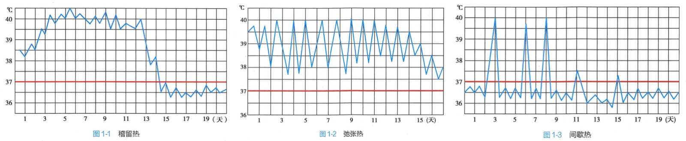
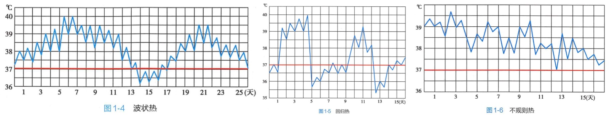

# 第一篇 常见症状

## 第一节 发热
发热（fever）是指机体在致热原作用下或各种原因引起体温调节中枢的功能障碍时，体温升高超出正常范围。

体温波动：升高：下午、月经前、青少年

### 一、机制
1. 致热源性发热

|  | 外源性发热 | 内源性发热 |
|---|---|---|
| 致热原 | ①细菌、病毒、真菌及细菌毒素等； ②炎性渗出物及无菌性坏死组织； ③抗原抗体复合物； ④某些类固醇物质（原胆烷醇酮）； ⑤多糖体成分及多核苷酸、淋巴细胞激活因子等 | 白介素（IL-1）、肿瘤坏死因子（TNF）、干扰素 |
| 分子量 | 大 | 小 |
| 穿过血脑屏障（直接作用于神经中枢） | 能 | 不能 |

2. 非致热源性发热
    - 体温调节中枢受损：颅脑外伤、出血、炎症
    - 引起产热过多：癫痫、甲亢
    - 引起散热减少：皮肤病变、心衰

3. 机制

### 二、病因
1. 感染性发热：细菌、病毒、真菌、支原体、立克次体、螺旋体、寄生虫
2. 非感染性发热
    1. 血液病、结缔组织病、变态反应性疾病、内分泌疾病（甲亢）
    2. 血栓及栓塞：心/肺/脾梗死、肢体坏死（吸收热）
    3. 颅内疾病、皮肤病变
    4. 恶性肿瘤
    5. 物理化学损害
    6. 功能性发热（自主神经功能紊乱）
        - 原发性低热：波动<0.5
        - 感染治愈后低热：与感染性低热鉴别（结核）
        - 夏季低热
        - 生理性低热：精神紧张、剧烈运动、妊娠期

### 三、临床表现

#### （一）过程
1. 体温上升期：疲乏无力、肌肉酸痛、畏寒；皮肤苍白、寒战
2. 高热期：皮肤发红灼烧感、寒战消失
3. 体温下降期：皮肤潮湿、出汗多

#### （二）分度

| 分度     | 体温  |
|----------|-------|
| 低热     | < 38℃ |
| 中等度热 | < 39℃ |
| 高热     | < 41℃ |
| 超高热   | > 41℃ |

> 口诀：三八三九四十一

#### （三）热型

|  | 常见于 | 表现 |
|---|---|:--|
| ①稽留热 | 大叶性肺炎、斑疹伤寒 | 恒定在高水平达数天或数周，24小时内波动<1℃ |
| ②弛张热 | 败血症、风湿热、重症肺结核及化脓性炎症 | 波动幅度大，24小时内波动>2℃，<mark style="background: #BBFABBA6;">但均大于正常</mark> |
| ③间歇热 | 疟疾、急性肾盂肾炎 | 骤升骤降，持续数小时，间歇数天 |
| ④波状热 | 布氏杆菌病 | 渐升渐降，持续数天，间歇数天 |
| ⑤回归热 | 回归热、霍奇金淋巴瘤 | 骤升骤降，持续数天，间歇数天（规律性交替） |
| ⑥不规则热 | 结核、风湿热、支气管炎、渗出性胸膜炎 | 发热的体温曲线无一定规律 |

> ①②一组，③④⑤一组

## 第十四节 腹痛

### 一、病因

| 急性腹痛 | 慢性腹痛 |
|---|---|
| ①腹腔脏器急性炎症：胃肠、胰腺、胆囊、阑尾 | ①腹腔脏器慢性炎症：+结核性腹膜炎、溃结、克罗恩 |
| ②空腔脏器阻塞或扩张：肠梗阻/套叠、胆道结石/蛔虫、泌尿结石 | ②脏器扭转或梗阻：慢性胃肠扭转、肠梗阻 |
| ③脏器扭转或破裂：肠系膜/大网膜扭转、卵巢囊肿蒂扭转、胃肠穿孔、肝/脾/异位妊娠破裂 | ③消化道运动障碍；④胃十二指肠溃疡 |
| ④腹膜炎症；⑤腹腔内血管阻塞；⑥腹壁疾病 | ⑤脏器包膜的牵张 |
| ⑦胸腔疾病牵涉痛：大叶性肺炎；肺梗、心梗、心绞痛；心包炎、胸膜炎 | ⑥中毒与代谢障碍 |
| ⑧全身疾病 | ⑦肿瘤压迫浸润 |

### 二、机制

|  | 内脏性 | 躯体性 | 牵涉痛 |
|---|---|---|:--|
| 机制 | 痛觉由交感神经传入脊髓 | 痛觉由体神经传入脊神经根→反映到脊髓节段支配的皮肤 | 痛觉传至脊髓节段，该节段支配体表部位疼痛 |
| 定位 | 模糊，接近腹中线 | 准确，在腹一侧 | 明确 |
| 疼痛 | 模糊，痉挛不适 | 剧烈而持续 | 剧烈 |
| 伴随 | 自主神经兴奋症状（恶心、呕吐、出汗） | 局部腹肌强直；腹痛可因咳嗽、体位变化加重 | 压痛、肌紧张、感觉过敏 |

不少疾病的腹痛涉及多种机制eg.阑尾炎

## 第三十一节

### 一、临床表现
| 意识障碍 | 临床表现                                          |
|----------|---------------------------------------------------|
| 嗜睡     | 唤醒后能正确回答和做出各种反应                    |
| 意识模糊 | 对时间、地点、人物的定向能力发生障碍                |
| 昏睡     | 不省人事（醒时答话含糊/答非所问）                   |
| 轻度昏迷 | 疼痛刺激有反应，各种反射均存在                     |
| 中度昏迷 | 剧烈刺激可有防御反射，各种反射减弱/迟钝            |
| 深度昏迷 | 各种刺激无反应，深浅反射均消失                     |
| 谵妄     | 兴奋性增高（感觉错乱「幻觉/错觉」、躁动不安、言语杂乱） |

